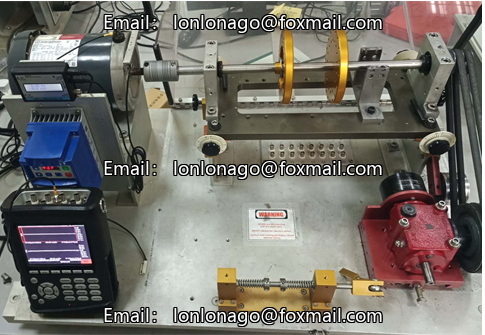
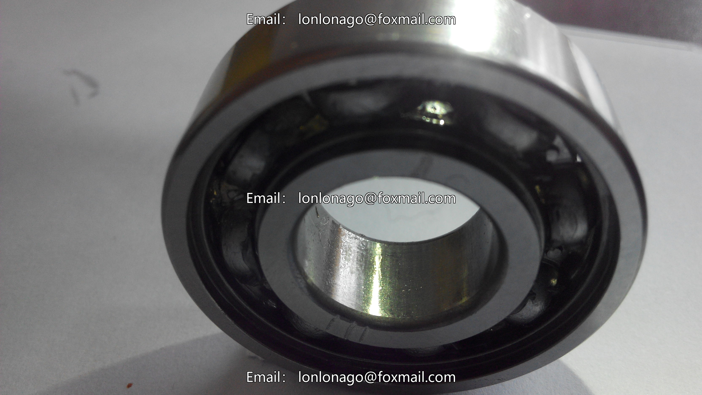
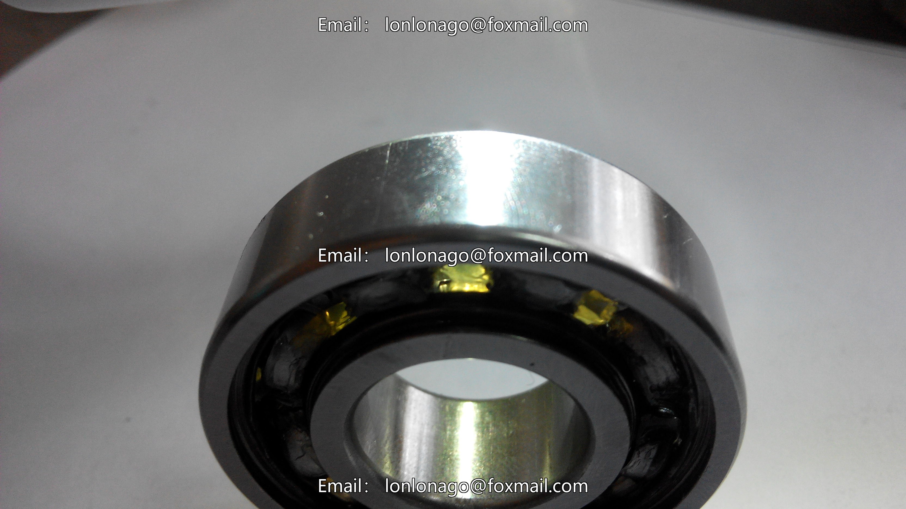

# Noise Shift Fault Data Set for Bearings

Bearing Model: NSK6203
Frequency Sampling: fs = 25600Hz
Channel 2: Vibration Signal
Channel 3: Speed Pulse Signal
Each test collection time is 15 seconds, consisting of a complete acceleration/deceleration process. It starts from the stationary state and gradually accelerates to 3000rpm, then stays stable, before gradually decelerating to 0

---

Image

Here is a pay link on Stripe ( https://buy.stripe.com/3cs8yP7sY87d0vu9AB ). Please contact me lonlonago@foxmail.com after funding $89, and I will send you a complete data files , thank you!

